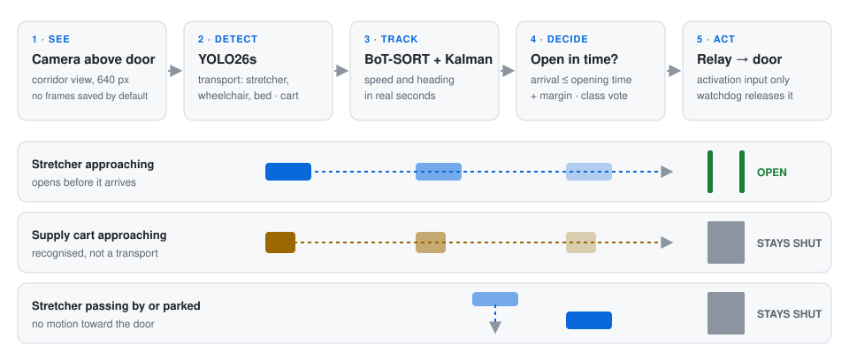

<h1 align="center">GurneyGate</h1>

<p align="center"><b>The door that sees the stretcher coming.</b></p>

<p align="center">
  <a href="LICENSE"></a>
  
  
</p>

<p align="center"></p>

GurneyGate watches a hospital corridor from a camera above a door. It recognises patient transports
(stretcher, wheelchair, hospital bed), tracks them, predicts when they will reach the door, and closes a
relay on the door operator's activation input so the door is already open when they arrive. Supply carts
are a separate class and are meant not to open the door (see [Limitations](#limitations)).

> **Research prototype.** GurneyGate has not yet run above a real door. The results below come from
> public hospital CCTV clips, stock video and simulation. It is an **activation sensor, not a safety
> device** (ANSI/BHMA A156.10): the door keeps its own safety sensors (EN 16005 / A156.10).

## Quick start
```bash
git clone https://github.com/mdandcoder/gurneygate && cd gurneygate
pip install -r requirements.txt
python -m pytest -q tests                      # 53 tests, no model or camera needed
python -m gurneygate.sim --headless --fps 6    # 11 simulated door scenarios
```
To run on video, download the detector from the [v0.1.0 release](https://github.com/mdandcoder/gurneygate/releases/tag/v0.1.0)
into `weights/` (see [`weights/README.md`](weights/README.md)), then:
```bash
python -m gurneygate.main --source video.mp4 --no-show       # a recording
python -m gurneygate.main --source rtsp://user:password@ip/stream
python -m gurneygate.main                                    # source from config.yaml
```
Quit with `q` or Esc. Orange line: door line. Red box: "open" decision. Blue box: a class that does not open the door.

## How it works
| Stage | Method | Why |
|---|---|---|
| Detect | YOLO26s, 640 px, classes `transport` (stretcher, wheelchair, bed) and `cart` | One class for everything that should open the door, one for what should not |
| Track | BoT-SORT, ReID off ([`gurneygate/trackers/botsort_door.yaml`](gurneygate/trackers/botsort_door.yaml)) | New tracks start above confidence 0.30; weaker detections only keep existing tracks alive |
| Estimate | Constant-velocity Kalman filter in seconds on the door-side edge of the box; heading from a least-squares slope over 0.5 s | Box jitter does not make a parked stretcher look as if it were approaching |
| Time | Every frame carries a real timestamp | A stalled camera does not inflate speeds; warning below 5 fps |
| Decide | Open when the time to arrival is at most the door opening time plus a margin, and the Wilson lower bound of the track's transport-vote share is at least 0.6, and the current frame does not say `cart` | A track that has crossed the door line, or was first seen past it, never opens |
| Confirm | Small trajectory MLP (entering / passing / other), trained on synthetic tracks | Long-range opening needs both the rule and the model; an at-door band opens on 0.5 s of motion toward the door |
| Act | Relay backends: dry run, GPIO, serial, HTTP | Released on normal exit, Ctrl-C, SIGTERM, and by a watchdog thread within 1 s when frames stop |

The watchdog cannot help if the process is killed hard (SIGKILL, power loss). For deployment, use a
relay that releases by itself, for example a Shelly with `?turn=on&timer=3` or a microcontroller with a timeout.

Privacy: frames are processed at 640 px in memory and written to disk only with `--save`. The system
keeps an event log (`logs/events.csv`), not video.

## Configuration
Calibrate [`config.yaml`](config.yaml) at installation:
- `decision.door_line_y`, `approach_direction`: where the door line is in the image, and which way is "toward the door".
- `door_open_time`, `lead_margin`, `max_trigger_distance`: measured opening time of the door operator and how early to trigger.
- `door.backend`: `dryrun | gpio | serial | http`. An HTTP relay needs `http_close_url`, or an open URL that
  times itself; otherwise the program refuses to start, because it could not release a latched relay.

How to record your own door for calibration, fine-tuning and evaluation: [`docs/FIELD_RECORDING.md`](docs/FIELD_RECORDING.md).

## Results
Detector `gurneygate-yolo26s`, confidence 0.25.

| Evaluation set | Transports found | False boxes |
|---|---|---|
| Hospital CCTV benchmark ([`benchmark/gold_cctv`](benchmark/gold_cctv)): 247 frames, 14 transport boxes; object seen (IoU ≥ 0.3) | 14 / 14 | 6 |
| Same, box must fit (IoU ≥ 0.5) | 12 / 14 | 8 |
| Held-out frames from YouTube videos and Open Images, split by video (145 transport boxes, reviewed by hand) | 122 / 145 | 2 |
| Open Images: a 15% held-out part of our Open Images pool, official boxes (435 transport boxes) | 338 / 435 | 64 |

The benchmark rows can be reproduced from this repository:
```bash
pip install yt-dlp
python benchmark/gold_cctv/rebuild.py      # downloads 4 public videos, checks every frame against its hash
python tools/eval_door.py --models gurneygate=weights/gurneygate-yolo26s.pt                # IoU >= 0.5
python tools/eval_door.py --models gurneygate=weights/gurneygate-yolo26s.pt --min-iou 0.3  # object seen
```
The two held-out rows use training-source images that are not redistributed.

**Door clips.** On door clips from the internet, the door opened only for approaching stretchers; no clip
with a supply cart or without a transport opened it. It missed one hospital CCTV clip in which a moving
stretcher overlaps a parked one. None of the clips was filmed from above a door, so they test false
openings rather than opening on time.

## Limitations
- **Carts.** The detector calls 22 of 117 held-out hospital carts `transport`, so such a cart approaching
  the door would open it. Adding 399 hospital cart boxes to the training data fixed this (4 / 117) but
  halved recall on the CCTV benchmark, so that model was not released. Data from the deployment camera is
  the expected fix.
- **Small, easy benchmark.** The 14 boxes come from about 6 distinct transports in 3 videos, and
  consecutive frames are not independent. Frames whose objects could not be boxed unambiguously were
  excluded; many show a transport far away, early in its approach. The benchmark was also used to choose
  between candidate detectors. Treat it as a validation set.
- **No field data.** Lead time and unnecessary openings per hour have not been measured at a real door.
  The protocol and scorer are ready (`docs/FIELD_RECORDING.md`, `tools/eval_events.py`).
- **Edge hardware.** An NCNN model for the Raspberry Pi 5 is included; it has not been benchmarked on
  the device (expected about 6 fps on the CPU).

## Repository
```
gurneygate/     the system: detector wrapper, tracker settings, Kalman filter, decision, relay, simulator
tests/          decision logic, time base, watchdog, relay release, evaluation statistics, training data
tools/          evaluation (per box, per event) and labelling helpers             → tools/README.md
benchmark/      hospital CCTV benchmark: labels, YouTube IDs, timestamps, hashes  → benchmark/gold_cctv/README.md
training/       training script and the recipe of the released weights           → training/README.md
weights/        intent model; detector weights come from the release            → weights/README.md
docs/           field recording guide, label schema, related work
```

## Data
Training images come from Open Images, Pexels and YouTube. They are not redistributed: copyright belongs
to their owners, and some show people. The benchmark ships labels, YouTube IDs, timestamps and frame
hashes only. Downloading the videos is subject to YouTube's Terms of Service.

## Related work
Opening doors on time from a camera or radar is not new (Allegion US 12188288 B2, NABCO NATRUS+e W),
and neither is a camera that treats wheelchair users differently at a lift door (MERL US 2004/0022439 A1).
GurneyGate adds **class-selective opening** at a corridor door: patient transports open it, supply carts
do not. It also adds lead time from a time-to-arrival estimate, an open benchmark and an event-level
evaluation protocol. See [`docs/LITERATURE.md`](docs/LITERATURE.md).

## Citation
If you use GurneyGate or its benchmark, please cite it ([`CITATION.cff`](CITATION.cff)):
```
Ozturk B. GurneyGate: Stretcher-Aware Door Activation for Hospital Corridors. 2026.
https://github.com/mdandcoder/gurneygate
```

## License
Copyright (C) 2026 Baris Ozturk.

- Code and model weights: **AGPL-3.0-only** ([`LICENSE`](LICENSE)). If you distribute GurneyGate or a
  modified version, or let users interact with a modified version over a network, you must offer them the
  corresponding source under the same license and keep this copyright notice. The detector is built on
  Ultralytics YOLO (AGPL-3.0); distributing it as part of closed-source software needs separate licenses.
- Benchmark labels and frame index: **CC BY 4.0** ([`benchmark/gold_cctv/LICENSE`](benchmark/gold_cctv/LICENSE)).
- The videos and images used for training and evaluation belong to their owners and are not redistributed.
